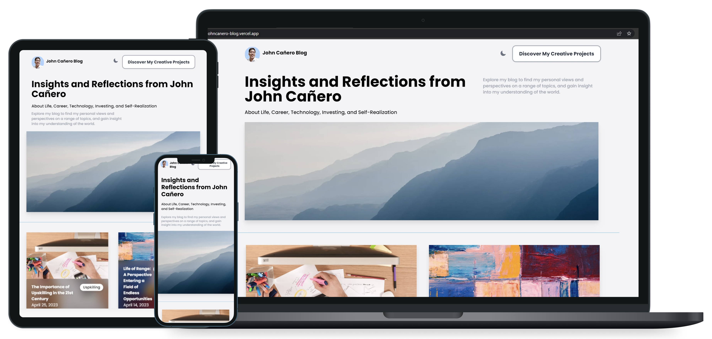
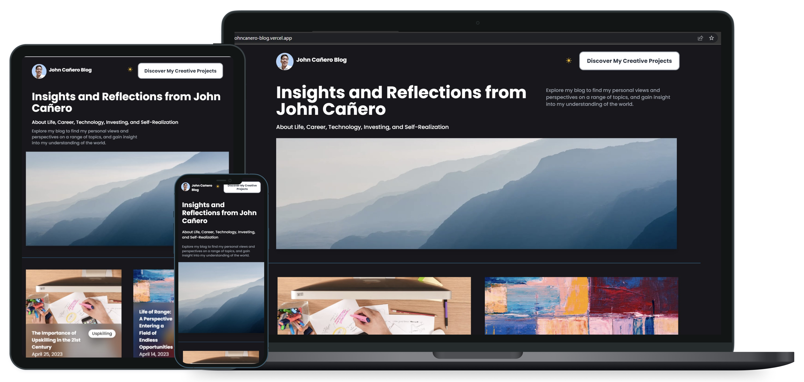
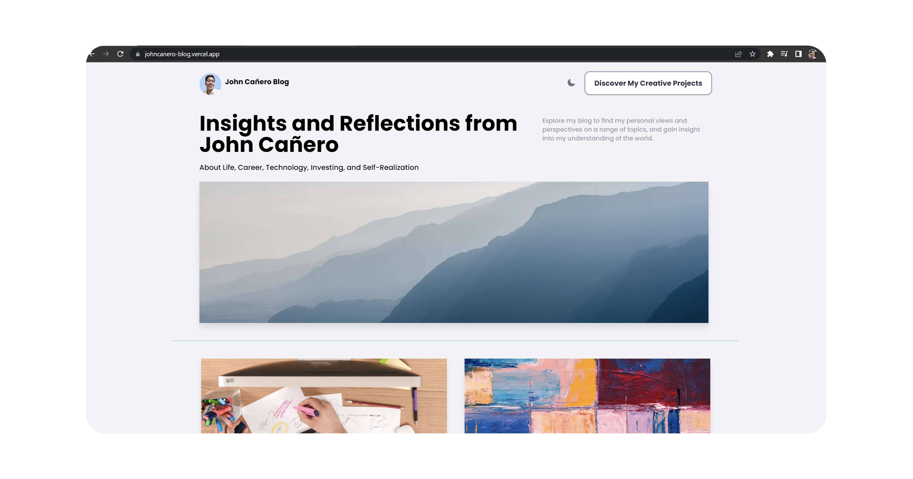
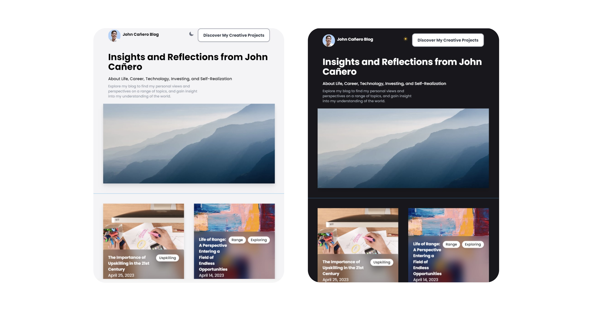
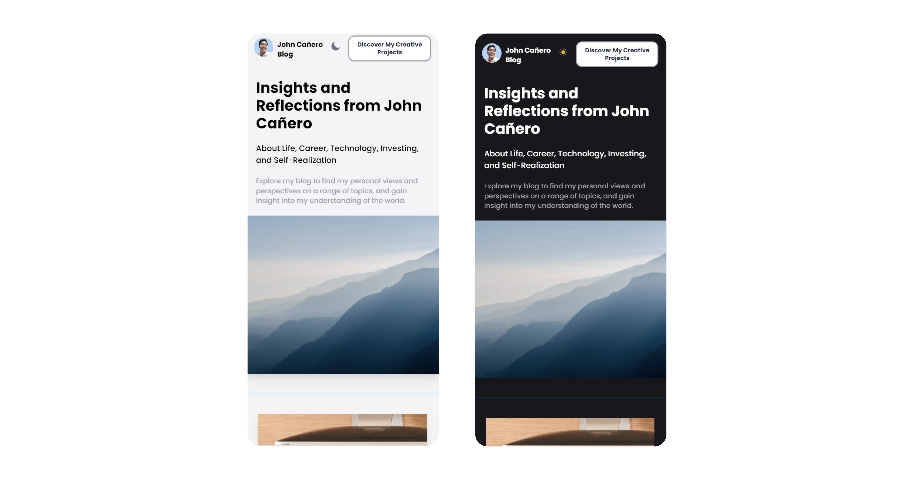

<!-- markdownlint-configure-file {
  "MD013": {
    "code_blocks": false,
    "tables": false
  },
  "MD033": false,
  "MD041": false
} -->

  

# John Cañero Blog

Insights and Reflections from John Cañero

About Life, Career, Technology, Investing, and Self-Realization

Explore my blog to find my personal views and perspectives on a range of topics,
and gain insight into my understanding of the world.

#blog #website #fullstackapplication #sanity

## Website

🖥️ [https://johncanero-blog.vercel.app/]

✍️ Project by John Cañero

## Responsive Design

🪟: [Desktop - Tablet - Mobile]

Responsive Feature Application Light

Responsive Feature Application Dark

Desktop Responsive Light

Tablet Responsive | Light and Dark

Mobile Responsive | Light and Dark

